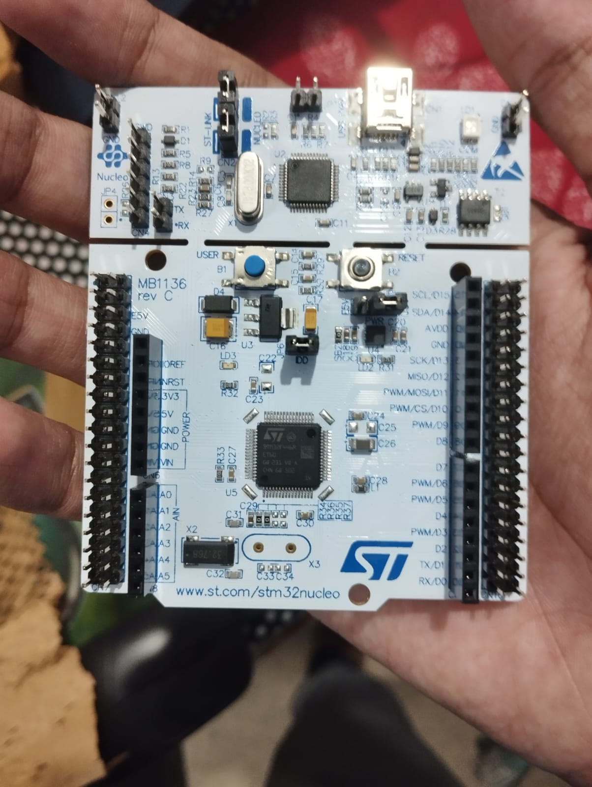

# My First STM32 Project

This repository documents my journey learning and experimenting with STM32 microcontrollers.

---

## 📅 26 September 2025
I received my STM32 board! Excited to start exploring what it can do.  

---

## 📅 27 September 2025
I wrote my very first program for the STM32. It’s a small but important step in learning embedded programming.  

